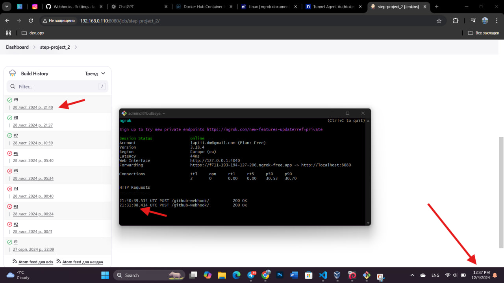

### We are provisioning two virtual machines using Vagrant. The configuration scripts for setting up the virtual machines are organized as separate files. The Jenkins master node has successfully established an SSH connection with the worker node. Credentials for the master to connect to the worker and enable Jenkins to push the latest version of the Docker image to Docker Hub have been configured.

